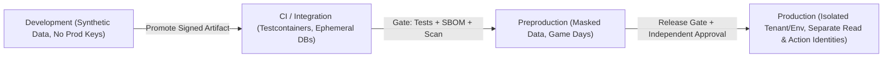
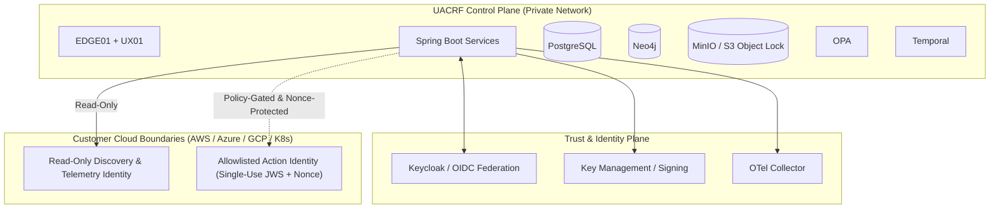

# UACRF Local & Target Deployment Infrastructure

## 1. Environment Promotion & Identity Isolation

```mermaid
flowchart LR
    Dev["Development (Synthetic Data, No Prod Keys)"] -->|Promote Signed Artifact| CI["CI / Integration (Testcontainers, Ephemeral DBs)"]
    CI -->|Gate: Tests + SBOM + Scan| Preprod["Preproduction (Masked Data, Game Days)"]
    Preprod -->|Release Gate + Independent Approval| Prod["Production (Isolated Tenant/Env, Separate Read & Action Identities)"]
```

## 2. Network & Trust Boundaries

```mermaid
flowchart TB
    subgraph ControlPlane["UACRF Control Plane (Private Network)"]
        EDGE["EDGE01 + UX01"]
        Services["Spring Boot Services"]
        PG[("PostgreSQL")]
        NEO[("Neo4j")]
        OBJ[("MinIO / S3 Object Lock")]
        OPA["OPA"]
        TEMP["Temporal"]
    end

    subgraph TrustOps["Trust & Identity Plane"]
        IDP["Keycloak / OIDC Federation"]
        KMS["Key Management / Signing"]
        OTEL["OTel Collector"]
    end

    subgraph CustomerCloud["Customer Cloud Boundaries (AWS / Azure / GCP / K8s)"]
        ReadOnly["Read-Only Discovery & Telemetry Identity"]
        ActionBoundary["Allowlisted Action Identity (Single-Use JWS + Nonce)"]
    end

    Services <--> IDP
    Services --> KMS
    Services --> OTEL
    Services -->|Read-Only| ReadOnly
    Services -.->|Policy-Gated & Nonce-Protected| ActionBoundary
```
