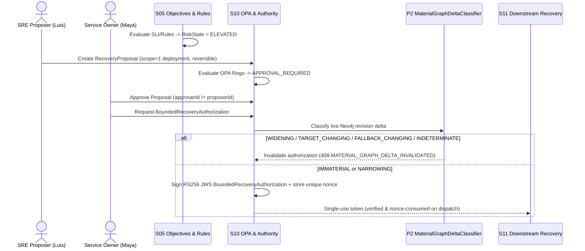

# Milestone 4 Flows — Continuous Control, OPA Policy, P2 Graph Delta & P3 Authorization

```mermaid
sequenceDiagram
    actor Proposer as SRE Proposer (Luis)
    actor Owner as Service Owner (Maya)
    participant S05 as S05 Objectives & Rules
    participant S10 as S10 OPA & Authority
    participant P2 as P2 MaterialGraphDeltaClassifier
    participant S11 as S11 Downstream Recovery

    S05->>S05: Evaluate SLI/Rules -> RiskState = ELEVATED
    Proposer->>S10: Create RecoveryProposal (scope=1 deployment, reversible)
    S10->>S10: Evaluate OPA Rego -> APPROVAL_REQUIRED
    Owner->>S10: Approve Proposal (approverId != proposerId)
    Owner->>S10: Request BoundedRecoveryAuthorization
    S10->>P2: Classify live Neo4j revision delta
    alt WIDENING / TARGET_CHANGING / FALLBACK_CHANGING / INDETERMINATE
        P2-->>S10: Invalidate authorization (409 MATERIAL_GRAPH_DELTA_INVALIDATED)
    else IMMATERIAL or NARROWING
        S10->>S10: Sign RS256 JWS BoundedRecoveryAuthorization + store unique nonce
        S10-->>S11: Single-use token (verified & nonce-consumed on dispatch)
    end
```
