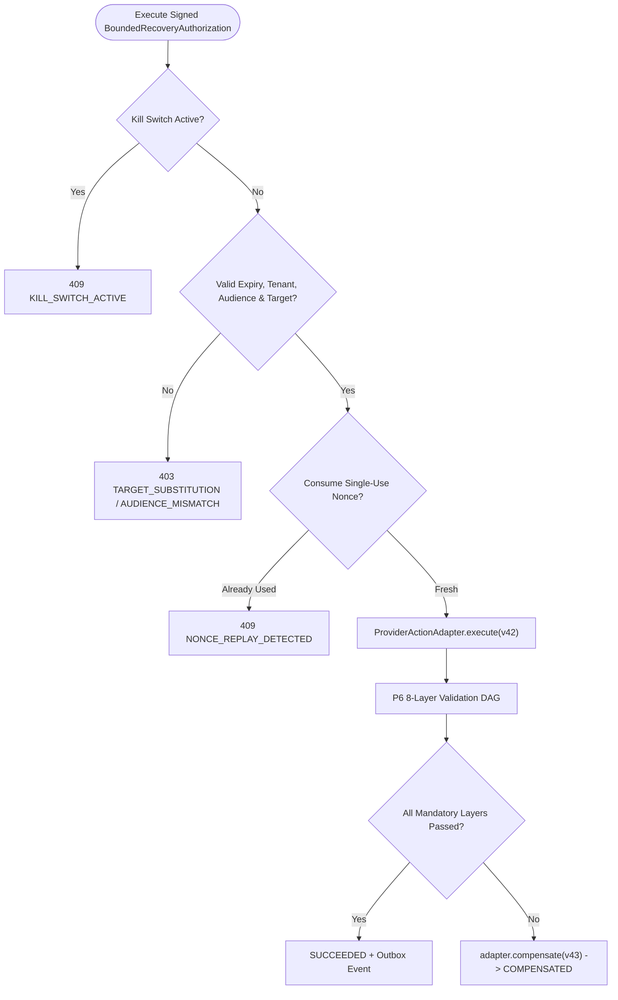

# Milestone 5 Flows — Recovery Orchestration (P3) & Cross-Layer Validation (P6)

```mermaid
flowchart TD
    Start([Execute Signed BoundedRecoveryAuthorization]) --> KS{"Kill Switch Active?"}
    KS -- Yes --> Block["409 KILL_SWITCH_ACTIVE"]
    KS -- No --> Checks{"Valid Expiry, Tenant, Audience & Target?"}
    Checks -- No --> Deny["403 TARGET_SUBSTITUTION / AUDIENCE_MISMATCH"]
    Checks -- Yes --> Nonce{"Consume Single-Use Nonce?"}
    Nonce -- Already Used --> Replay["409 NONCE_REPLAY_DETECTED"]
    Nonce -- Fresh --> Adapter["ProviderActionAdapter.execute(v42)"]
    Adapter --> DAG["P6 8-Layer Validation DAG"]
    DAG --> Mandatory{"All Mandatory Layers Passed?"}
    Mandatory -- Yes --> Succeeded["SUCCEEDED + Outbox Event"]
    Mandatory -- No --> Comp["adapter.compensate(v43) -> COMPENSATED"]
```
