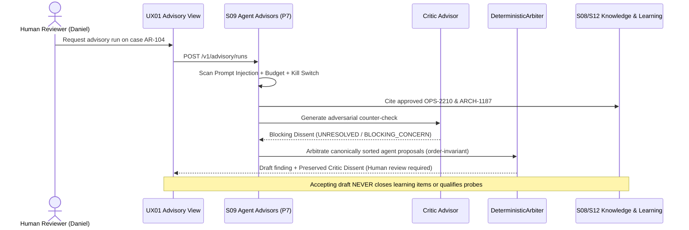

# Milestones 6–8 Flows — Knowledge, Advisory Dissent (P7), Learning & Quantitative Benchmarks

```mermaid
sequenceDiagram
    actor Human as Human Reviewer (Daniel)
    participant UX as UX01 Advisory View
    participant S09 as S09 Agent Advisors (P7)
    participant CRIT as Critic Advisor
    participant ARB as DeterministicArbiter
    participant S08 as S08/S12 Knowledge & Learning

    Human->>UX: Request advisory run on case AR-104
    UX->>S09: POST /v1/advisory/runs
    S09->>S09: Scan Prompt Injection + Budget + Kill Switch
    S09->>S08: Cite approved OPS-2210 & ARCH-1187
    S09->>CRIT: Generate adversarial counter-check
    CRIT-->>S09: Blocking Dissent (UNRESOLVED / BLOCKING_CONCERN)
    S09->>ARB: Arbitrate canonically sorted agent proposals (order-invariant)
    ARB-->>UX: Draft finding + Preserved Critic Dissent (Human review required)
    Note over UX,S08: Accepting draft NEVER closes learning items or qualifies probes
```
